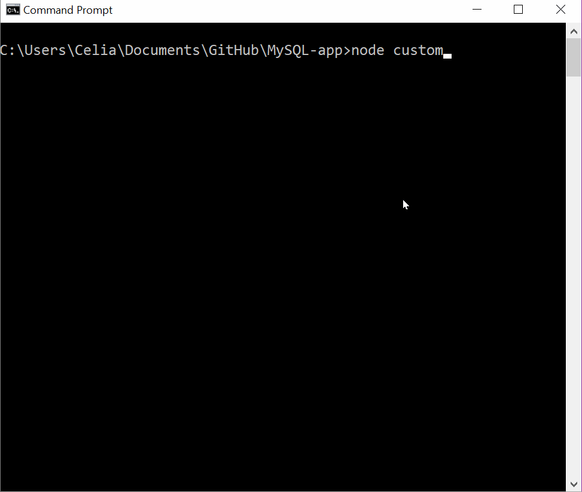
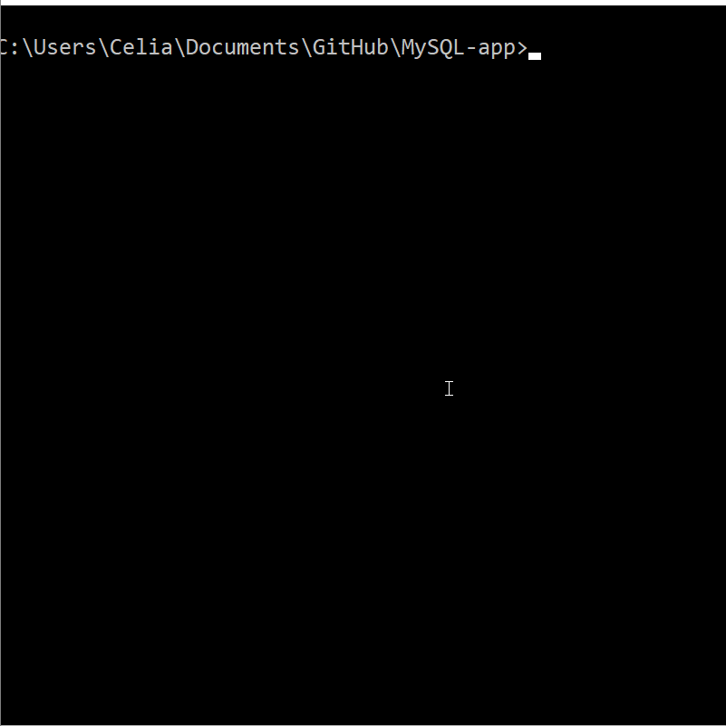
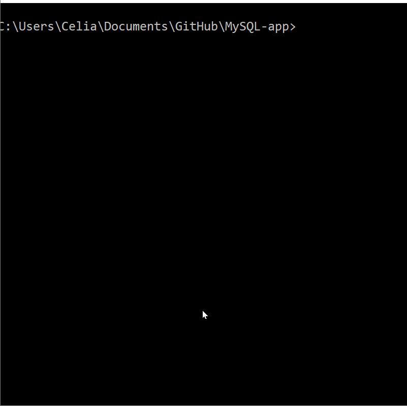
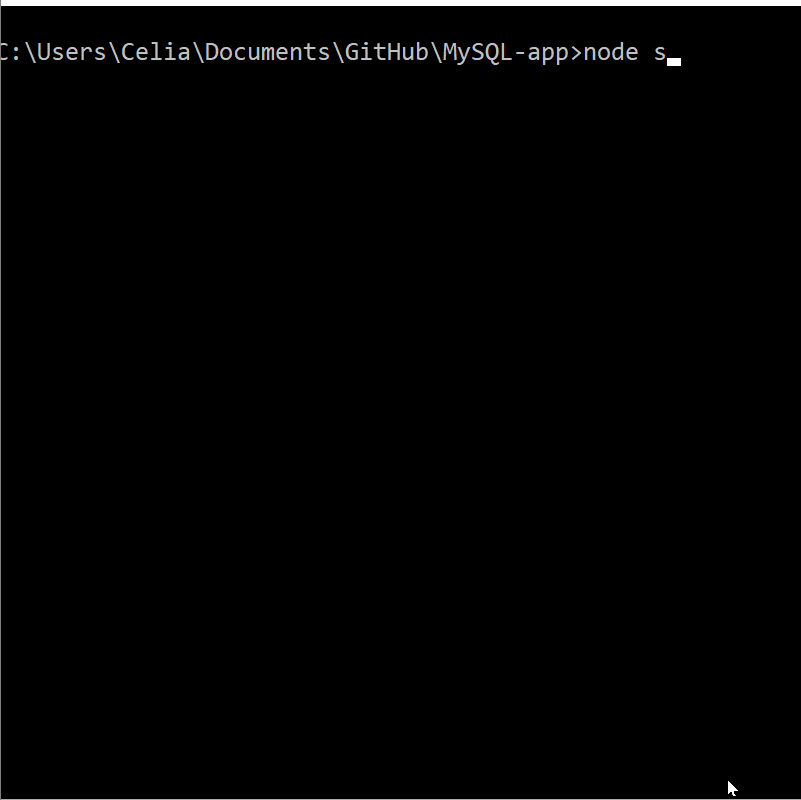

# MySQL-app
Welcome to Bamazon, a command-line app for customers, managers, and supervisors. This app uses Javascript and MySQL to update items in the database in realtime. 

## Customer
Customer functionality is very simple. You can buy a quantity of one product at a time. Once you select the product and let the program know the amount you want, it informs you of your total cost and whether or not your order went through. If you change you mind while purchasing' simply enter '0' for the quantity to be bought and you won't buy anything.

## Manager
Managers have the most functionality of the three groups. They have six different options for interacting with the database:

* **VIEW ALL.** Managers can view all of the items currently for sale.
* **VIEW LOW.** Managers can view all product which have less than 5 items currently in stock.
* **ADD INVENTORY.** Add inventory to a specified product. You cannot add negative numbers.

* **ADD PRODUCT.** Adds a product to the database. 
* **REMOVE PRODUCT.** Removes a product from the database. Since this is an irreversible change, the manager is prompted a second time to be sure.
* **EXIT.**

## Supervisor
Supervisor has 4 different functionalities. 

* **VIEW SALES.** View various stats about the departments, inluding a total sals column.
* **CREATE NEW DEPARTMENT.** This only creates a new department, and does not include functionality to add any new products.
* **DELETE DEPARTMENT.** This deletes the department as well as all products associated with the department. Since this is an irreversible change, the supervisor is prompted a second time to be sure this is the action they want to take.
* **EXIT.**

